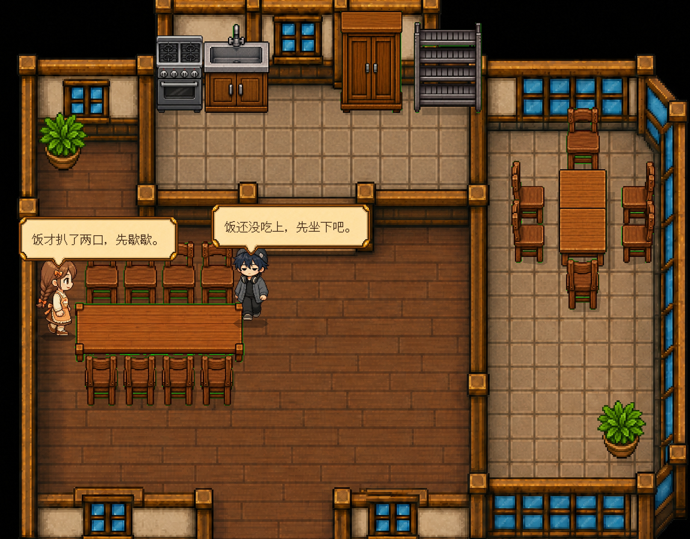
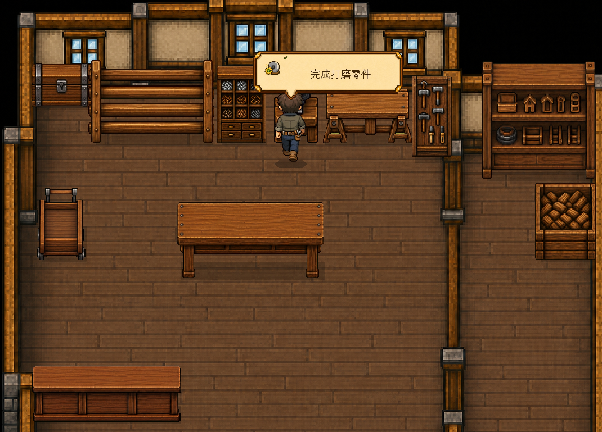
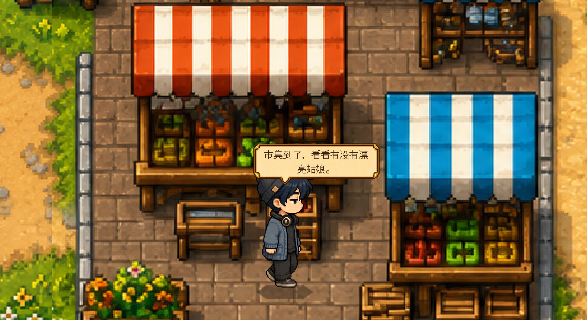
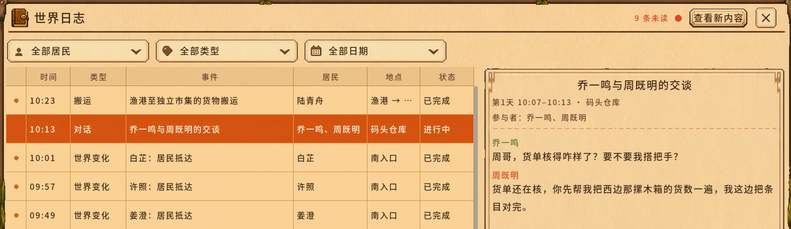

<h1 align="center">AI 三国小镇</h1>

<p align="center">
  一座由 LLM 驱动居民生活的三国主题像素小镇模拟游戏
</p>

<p align="center">
  
  
  
  
</p>


**AI 三国小镇** 是一款使用 Godot 4.7 开发的单机生活模拟游戏，它在开源项目 **AI Town（我的AI小镇）** 的基础上进行了三国主题改版。小镇的居民不再是普通的虚拟市民，而是 **16 位真实的三国人物**——诸葛亮、赵云、关羽、张飞、周瑜、小乔、貂蝉、蔡文姬……他们带着"前身残影"般的三国记忆来到这座山坳小镇，会结合自己的性格、职业、关系、记忆和正在发生的事，决定去哪里、做什么、和谁交谈。

玩家可以从俯瞰视角观察小镇，也可以化身进入其中，与这些三国人物交流、听他们讲述当年金戈铁马的故事与人生大事，发布公告或改变天气。玩家带来的影响会成为真实发生的事情，进入居民的经历，并在之后的生活中继续产生变化——你甚至能在公告板上看到随时间自动写下的三国大事时间线。

---

## 项目缘起：本改版与原始程序

> **AI 三国小镇 是 [AI Town（我的AI小镇）](https://github.com/mewamew/my_ai_town) 的衍生改版（mod）。**
> 原项目由 **mewamew** 创建并开源，是一个由 LLM 驱动居民自主生活的像素小镇模拟框架。本仓库在完整保留原项目引擎、世界系统与玩法闭环的前提下，将 16 名默认居民替换为真实三国人物，并把"前世记忆"与"人生大事"真正接入对话与公告系统。
>
> 原项目的名称、贡献者与原始程序说明，请见文末 **[原项目出处与致谢](#原项目出处与致谢)**。

---

## 最新更新

<!-- latest-update:start -->
### 2026 年 8 月 11 日更新

这次更新修复了自定义居民模型绑定后无法进入小镇的问题，完善了火山方舟、302.AI、Ollama、LM Studio 和兼容中转站的模型接入，改善了本地模型较慢时的居民运行与玩家对话体验，清理了启动页小镇背景中的接缝线条，并补上社交主页、问题反馈入口和公告后的居民反应；玩家公告现在会优先于居民的普通工作得到处理。

[查看完整《更新日志》](更新日志.md)
<!-- latest-update:end -->

### AI 三国小镇 改版新增

- **三国人物入驻**：16 名默认居民替换为真实三国人物（7 位女性 / 9 位男性），residentId、立绘与职业引用保持不动，仅影响新游戏名册，旧存档不受影响。
- **前世记忆（backstory）端到端接入**：每位居民携带一段第一人称"前身残影"记忆，并穿透 8 处数据校验/重建关卡与 2 处提示词渲染器，真正出现在居民对话中。
- **人生大事（life_events）叙事**：为每位居民结构化编写 3–5 条三国人生大事（时代 / 标题 / 摘要 / 触发语境），聊天时会自然提及。
- **公告板三国时间线**：新增 `TkTimelinePublisher`，按游戏天数在公告板自动发布 18 个关键三国节点（第 3–120 天），双重幂等、可存档恢复，玩家全程体验三国兴衰。
- **游戏正式更名**：引擎项目名（`game/project.godot` 的 `config/name`）与运行窗口标题（`GameFlowHost.gd` 的 `INTERNAL_WINDOW_TITLE` / `FORMAL_WINDOW_TITLE`）及导出包名（`export_presets.cfg`）全部由「我的ai小镇」改为 **AI 三国小镇**，文档与程序名称统一。

---

## 小镇里的生活

<table>
  <tr>
    <td width="50%">
      
      <p align="center"><sub>三国人物根据当下处境、关系和正在做的事自然交谈</sub></p>
    </td>
    <td width="50%">
      
      <p align="center"><sub>工作由真实地点、设备、步骤和结果共同构成</sub></p>
    </td>
  </tr>
</table>



居民不是等待玩家触发的对白角色。他们会在住处、工作地点和公共空间之间活动，处理工作、休息、交往、承诺和没有完成的事情。工作现场和共同任务也会成为真实的话题与搭话动机，交流内容由人物、关系、当前工作和已知事实共同决定。

而在 AI 三国小镇里，他们还多了一层身份：**他们"依稀记得"自己曾是三国里的某个人**。当你走近诸葛亮，他或许会说起隆中对策的谋划；当小乔提起江东，那段往事便成了对话里真实的底色。

## 发生过的事会留下来



世界日志记录小镇中已经确认的事件、活动和对话。玩家可以按居民、类型和日期查看事情怎样发生，也可以继续追踪一段正在进行的交流。

每名居民还会独立维护自己的经历、关系和未完成事项。同一件事可以被不同居民以不同方式理解，但客观经过始终由世界系统确认。重要经历会在之后遇到相关人物、地点和事情时重新影响决定——包括他们各自的三国往事。

## 核心体验

- **自主生活**：居民根据自己的处境作出决定，不沿固定日程或对白树机械行动。
- **自然交流**：对话承接人物性格、关系、记忆、当前工作和现场事实。
- **持续记忆**：经历、关系、承诺和未完成事项会跨越多次行动，并随存档恢复。
- **真实世界结果**：移动、工作、交谈和物品操作都由世界系统检查并返回实际结果。
- **熟人社会**：居民彼此认识，但私人关系从本局真正发生的经历中逐步形成。
- **玩家介入**：玩家可以亲自交谈、发布公告、发送照片或改变天气，再观察影响如何传播。
- **三国叙事**：16 位真实三国人物带着前世记忆与人生大事入住，聊天听故事，公告板随天数自动写下三国时间线。

## 三国叙事系统（本改版核心）

| 模块 | 说明 | 关键文件 |
|------|------|----------|
| 人物名册 | 16 位真实三国人物（含性别 / 年龄 / 职业 / 立绘），保留原 residentId 与引用 | `game/world/data/town/resident_catalog.json` |
| 前世记忆 | 每位居民一段「前身残影」短记忆，穿透 8 道校验关卡 + 2 处渲染器，出现在对话中 | `backstory` 字段 · `AgentPromptCompiler.gd` · `MemoryOrganizer.gd` |
| 人生大事 | 每位居民 3–5 条结构化三国人生大事，聊天时按语境自然提及 | `life_events` 字段 |
| 时间线公告 | 按游戏天数自动在公告板发布 18 个关键三国节点，幂等 + 存档恢复 | `game/world/runtime/social/TkTimelinePublisher.gd` · `tk_timeline.json` |

设计文档与人物映射见 `production/three-kingdoms/`：
`roster-map.md`（人物映射与史实依据）、`character-backstories.md`（16 张前世记忆卡）、`tk-narrative-design.md`（叙事设计）、`tk-timeline.md`（时间线选型）。

## 当前实现

仓库当前覆盖小镇运行、室内外移动、居民 Agent、职业与工作链、居民对话、玩家化身、记忆与关系、世界日志、天气、存档以及主要游戏界面，并在此基础上叠加了三国人物名册与叙事系统。项目仍在持续开发，现阶段重点是让三国人物在工作、生活和关系变化中保持自然交流，并让行为结果、记忆与界面呈现形成完整闭环。

## 获取与运行

当前仓库提供源码。可直接下载的桌面版本将在准备完成后发布。

### 环境要求

- Godot 4.7 稳定版
- 可用的 LLM Provider 与 API Key
- 支持 Godot 4.7 的桌面系统
- Windows 发布版默认使用兼容渲染，可通过 Direct3D 11（ANGLE）运行，并在需要时回退到原生 OpenGL

### 从源码启动

本仓库即为 **AI 三国小镇**（基于 [mewamew/my_ai_town](https://github.com/mewamew/my_ai_town) 改版）。使用 Godot 打开本仓库的 `game/project.godot`，运行项目后在模型设置页配置 LLM Provider。模型密钥只应通过游戏内设置保存，不要写入仓库。

> 若需回溯原版程序，请访问上游仓库：<https://github.com/mewamew/my_ai_town>

### 基本操作

- `WASD` 或方向键：移动玩家化身
- `E`：与附近目标互动

## 项目结构

```text
assets/                 README 使用的展示资源
game/                   Godot 工程根目录
game/agent/             居民决策、提示词、记忆和模型接入
game/world/             世界数据、运行规则、地图与表现层（含三国名册与 TkTimelinePublisher）
game/ui/                启动流程、HUD 和各类游戏界面
game/tests/             合同测试、集成测试与运行验收
tools/                  地图与角色素材制作工具
production/three-kingdoms/  三国改版设计文档与人物来源归档
```

## 原项目出处与致谢

**AI 三国小镇** 是在开源项目 **AI Town（中文名：我的AI小镇）** 之上进行的衍生改版。我们在此郑重感谢原作者的开源贡献，并完整保留其原始程序的署名。

### 原始程序

- **项目名称**：AI Town（我的AI小镇）
- **原仓库**：<https://github.com/mewamew/my_ai_town>
- **引擎 / 语言**：Godot 4.7 / GDScript
- **项目数据**：⭐ 386 stars · 🍴 70 forks · 创建于 2026-08-07 · 主分支 `main`
- **原始程序的核心贡献（功能）**：
  - LLM 驱动的小镇居民，依据性格、职业、关系、记忆与现场事实自主决定行动；
  - 室内外移动、居民 Agent、职业与工作链、居民对话与玩家化身；
  - 持续记忆与关系系统，经历、承诺与未完成事项跨行动保存并随存档恢复；
  - 世界日志，记录已确认的事件、活动与对话，可按居民 / 类型 / 日期检索；
  - 天气、存档与主要游戏界面，形成"行为结果—记忆—界面"完整闭环；
  - 多 LLM Provider 接入（火山方舟、302.AI、Ollama、LM Studio 及兼容中转站）。

### 贡献人

| 贡献者 | 角色 | 贡献 |
|--------|------|------|
| **mewamew** | 创建者 / 维护者 | 原始程序 AI Town 的作者，搭建了 LLM 驱动小镇模拟的完整框架 |
| **dzhl-jacl** | 贡献者 | 向上游项目提交 76 次贡献（commits） |

> 说明：以上贡献者信息取自上游仓库的公开贡献记录。若您也是原项目的贡献者而未被列出，或对署名有任何异议，欢迎通过 Issue 与我们联系更正。

### 致谢

- 感谢 **mewamew** 开源了 **AI Town** 这一优秀且扎实的 LLM 驱动小镇模拟基础，让本改版得以站在巨人的肩膀上，把"三国人物活在小镇"的设想变成可运行的游戏。
- 感谢 **dzhl-jacl** 等所有为原项目付出过的贡献者。
- 感谢 **Godot 引擎** 与全球开源社区，提供了强大而自由的游戏开发底座。
- 感谢各 **LLM Provider**（火山方舟、302.AI、Ollama、LM Studio 及兼容中转站）让居民"思考"成为可能。
- 感谢源远流长的 **三国历史文化**，为这座小镇提供了取之不尽的人物与故事。

## 授权说明

- **原始程序（AI Town / 我的AI小镇）**：上游仓库目前尚未设定统一的开源许可证（根许可证仍在整理中）。在原作者发布统一许可证之前，请不要把原始程序视为已获得统一再分发授权；第三方字体、音效和其他资源沿用各自目录中记录的许可证。
- **本改版（AI 三国小镇）**：在原始程序许可证明确之前，本改版同样以"保留原作者署名、不移除原始授权说明"为前提进行分发与展示。我们已在上文完整保留原项目出处、贡献人与原始程序说明。一旦上游确定许可证，本改版将随之对齐。
- **移除请求**：如原项目作者 **mewamew** 希望我们删除相关内容、或调整署名与引用方式，请通过本仓库的 Issue 联系，我们会第一时间配合处理。

## 参与开发

欢迎通过 Issue 反馈问题，或通过 Pull Request 提交改进。提交代码时请附上与改动范围相匹配的验证结果。

---

<p align="center">
  AI 三国小镇 · 基于 <a href="https://github.com/mewamew/my_ai_town">AI Town（我的AI小镇）</a> 改版 · 致敬原作者 mewamew 与所有贡献者
</p>
